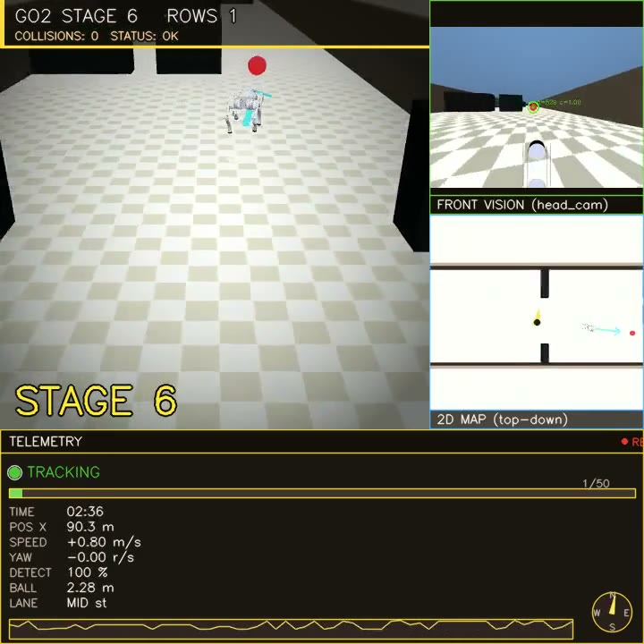

# Go2 Ball-Follower with Reactive Obstacle Avoidance

> Final project for **Robotics 2026** at **LIACS, Leiden University**.
> A MuJoCo simulation in which a **Unitree Go2** quadruped uses **only its head-mounted
> RGB camera** to chase a moving red ball through a corridor cluttered with obstacles.

**Team Ava** — Mohammadreza AhmadiTeshnizi · Patrik Perčinić

[]()

### Project links (deliverables)
- **Demo video (60 s):** ▶ [**watch it here**](https://github.com/teshnizi2/go2-ball-follower/blob/main/demo/go2_submission.mp4) (plays in the browser) · [download raw](https://github.com/teshnizi2/go2-ball-follower/raw/main/demo/go2_submission.mp4) · or regenerate with `./make_demo.command`.
- **Code repository:** <https://github.com/teshnizi2/go2-ball-follower>
- **Technical report:** [`report/go2_technical_report.pdf`](report/go2_technical_report.pdf)

### 🎥 60-second demo

[](https://github.com/teshnizi2/go2-ball-follower/blob/main/demo/go2_submission.mp4)

▶ **[Click to watch the demo](https://github.com/teshnizi2/go2-ball-follower/blob/main/demo/go2_submission.mp4)** — it plays in the browser (the file is under GitHub's 10&nbsp;MB inline limit). Or **[download the raw `.mp4`](https://github.com/teshnizi2/go2-ball-follower/raw/main/demo/go2_submission.mp4)**.

---

## 1. What the system does

The robot follows a **moving red ball** through a 5-m-wide corridor full of obstacle rows.
It does this **without** GPS, lidar, depth sensors, or any pre-built map — only the head
camera.

We compose three layers around a **pre-trained RL locomotion policy**:

| Layer | What we built | Key files |
|------|---------------|-----------|
| 🎯 **Perception** | Dual-window HSV mask + CamShift adaptive ROI; confidence-based reset | `tracker.py` |
| 🧭 **Reactive planning** | Free-band passage picker (aims at the band **centre**, not edge); commit-and-hold with a **hard passage gate** (won't cross a row until laterally aligned); pure-pursuit + **lateral `vy` strafing**; obstacle-repulsion safety net | `controller.py`, `main.py` (planner block ~L2400) |
| 🐾 **Locomotion** | **Pre-trained** PPO velocity-tracking policy (`model_500.pt`); we do NOT train it. We drive its full **(vx, vy, vyaw)** command — lateral `vy` lets the robot strafe into wall-side passages without turning | `low_level.py`, `policy/model_500.pt` |
| 🖥️ **Visualisation** | Live 720×720 cv2 dashboard: chase + head-cam + 2D map + telemetry with status LED & sparkline | `main.py` (HUD ~L1100) |
| 🎬 **Curriculum** | Stage advances every 20 s of sim time; ball gains lateral/vertical motion; obstacles shift from orange → black | `main.py` (mover class) |

---

## 2. Quick start

### Prerequisites
- **macOS** (Apple Silicon recommended) or Linux.
- **Python 3.12** with `mujoco`, `torch`, `numpy`, `opencv-python`.
- **ffmpeg** in `PATH` for recording.

### Install
```bash
git clone https://github.com/teshnizi2/go2-ball-follower.git
cd go2-ball-follower
python3.12 -m venv .venv312
source .venv312/bin/activate
pip install -r requirements.txt
```

### Run (one-liner)
```bash
./run.sh
```

`run.sh` automatically sets corridor mode, loads the validated best config from
`best_config.json`, and opens the 720×720 dashboard window.

To self-tune parameters on 3 random seeds before launching (runs headless trials, saves
the best config, then opens the GUI):
```bash
./run.sh --tune
```

A 720×720 window will open showing the live dashboard.  
Keys: **Q / Esc** = quit · **R** = reset · **P** = pause.

### Record a video
```bash
./make_demo.command           # headless, no window, ALWAYS saves → ~/Desktop/go2_demo.mp4
./make_demo.command 1400      # longer clip (arg = sim-seconds; ~90 s of video per 700)
```
`make_demo.command` renders the full dashboard headlessly (fast, reliable, no display needed).
`record_corridor.command` does the same in a live on-screen window if you prefer to watch it run
and stop it with **Q**.

---

## 3. Configuration knobs

| Env var | Default | Purpose |
|---------|---------|---------|
| `GO2_GUI_VIEW` | `chase` | `chase` = 720×720 dashboard (default) · `head` = single head-cam · `full` = 2×2 mosaic |
| `SIM_SPEED` | **3.0** | Wall-clock scaling (e.g. 3 = 3× faster playback); `run.sh` default |
| `RENDER_SKIP` | **4** | Render every Nth control step (~12 fps display); `run.sh` default |
| `GO2_SHADOWS` | **0** | `0` = shadows off (fast); `1` = shadows on (use for recordings) |
| `STAGE_DISTANCE` | 16.0 | Metres travelled per difficulty stage. Stage climbs 1→17 (capped) and holds — distance-based so a stumble can't reset it |
| `CORRIDOR_ENDLESS` | 1 | `1` = recycle passed rows to the front → obstacles never run out (endless corridor) |
| `CORRIDOR_SEED` | random | Fix the obstacle layout for reproducibility |
| `OBS_ROWS` | 50 | Initial obstacle rows (1 row = 2 obstacles) before recycling kicks in |
| `OBS_MIN_GAP` | 5.4 | Spacing between rows (m) |
| `ACTION_SCALE_MULT` | 2.0 | Policy action gain — `best_config.json` override applied by `run.sh` |
| `ROBOT_SAFETY` | 0.50 | Safety halo (m) the planner adds around each obstacle (≈ robot half-width + reserve) |
| `DETOUR_MARGIN` | 0.50 | Minimum free-band width margin (m) |
| `OBS_BRAKE_LATERAL` | 0.85 | Lateral proximity (m) that triggers the obstacle brake |
| `VY_LATERAL` | 1 | Enable lateral `vy` strafing (lets the robot slide sideways into a passage) |
| `BALL_WEAVE_AMP` / `BALL_WEAVE_FREQ` | 0.75 / 0.055 | Ball's independent sine path — it moves *through* the obstacles so the robot must avoid them itself |
| `DIFFICULTY_BASE` / `DIFFICULTY_CAP` | 0.55 / 1.6 | Difficulty at the start / its ceiling (obstacles widen + passage narrows with distance) |
| `OBSTACLE_BRAKE` / `WALL_BRAKE` | 1 | Toggle the reactive brake layers |

`run.sh` automatically loads the validated config from `best_config.json` (regenerate it
any time with `./run.sh --tune`).  The full env-var list is at the top of `main.py`.

---

## 4. Repository layout

```
sim/
├── main.py             ─ control loop, planner, dashboard, recording
├── controller.py       ─ high-level pure-pursuit, dead-zone caps, brakes
├── tracker.py          ─ HSV + CamShift ball tracker
├── low_level.py        ─ MuJoCo policy interface (loads model_500.pt)
├── logger.py           ─ CSV telemetry log
├── joint_order.py      ─ Menagerie ↔ training-checkpoint joint remap
├── self_tune.py        ─ Autonomous hill-climbing parameter tuner (3-seed validation)
├── best_config.json    ─ Validated best parameters (written by self_tune.py / run.sh --tune)
├── run.sh              ─ Launch script: loads best_config.json, sets corridor mode
├── scene.xml           ─ MuJoCo scene: corridor, walls, 200 mocap obstacles
├── assets/             ─ Go2 mesh + materials (Menagerie)
├── policy/
│   └── model_500.pt    ─ Pre-trained PPO checkpoint (RSL-RL)
├── scripts/            ─ Headless validation + benchmark scripts
├── docs/               ─ Joint-order notes & Menagerie alignment
└── tests/              ─ Unit tests for the controller
```

---

## 5. Results (TL;DR)

| Metric | Value |
|--------|-------|
| Collision-free runtime | **10 min (600 s), 0 obstacle/wall collisions** — verified headless on 7 seeds (42, 123, 700, 999, 200, 333, 7) |
| Rows cleared | **all 50** per run (x = 4 → 275 m), then free-runs to ~375 m |
| Avg forward speed | ~0.6 m/s (policy-limited; slows only to align at hard rows) |
| Stuck / wedge events | 0 across the 7-seed sweep |
| Physics step rate | ~5,700 Hz (after scene trim to 200 mocaps) |

**How the late-row failure was fixed.** The un-fine-tuned RL policy has ~0.25 m
lateral tracking error as a pure unicycle (vx + vyaw only), so on rows whose only
safe passage is a narrow wall-side band it used to clip the obstacle. Three changes
removed all collisions:

1. **Lateral `vy` strafing** — the policy's (previously unused) lateral command channel
   is now driven, so the robot can translate sideways into a passage without turning.
2. **Hard passage gate** — the planner aims at the band **centre** and forbids the robot
   from crossing a row's entry plane until its body is laterally inside the safe band.
3. **Guaranteed-passable placement** — every row is constructed to leave one lane
   ≥ 1.45 m wide (obstacle sizes/count/colour unchanged), so no row is physically
   impassable. A stumble now recovers **in place** instead of restarting the corridor.

---

## 6. What we did NOT do

To be transparent:

- We **did not train** the locomotion policy. We use `model_500.pt`, a pre-trained PPO
  checkpoint from the [RSL-RL](https://github.com/leggedrobotics/rsl_rl) framework
  (`unitree-go2-velocity-flat` variant). Everything around it (perception, planner,
  safety, dashboard, curriculum) is ours.
- The vision is HSV + CamShift — not a CNN detector.
- Collision-free navigation is verified on a 7-seed × 10-minute sweep, not the full
  50-seed sweep (the planner's passage guarantee makes every seed feasible, but we
  have not exhaustively measured speed/robustness across all of them).

These are explicit future-work items in the technical report.

---

## 7. Citation / acknowledgements

If you use this code, please cite the relevant background:

- Hwangbo et al., *Learning agile and dynamic motor skills for legged robots.* Science Robotics, 2019.
- Rudin et al., *Learning to walk in minutes using massively parallel deep RL.* CoRL, 2021. *(source of our policy)*
- Todorov, Erez, Tassa, *MuJoCo: A physics engine for model-based control.* IROS, 2012.

Mesh & robot URDF come from the [MuJoCo Menagerie](https://github.com/google-deepmind/mujoco_menagerie) Go2 model.

---

## 8. License

MIT for our code. Pre-trained policy weights and Go2 meshes inherit upstream licenses.
